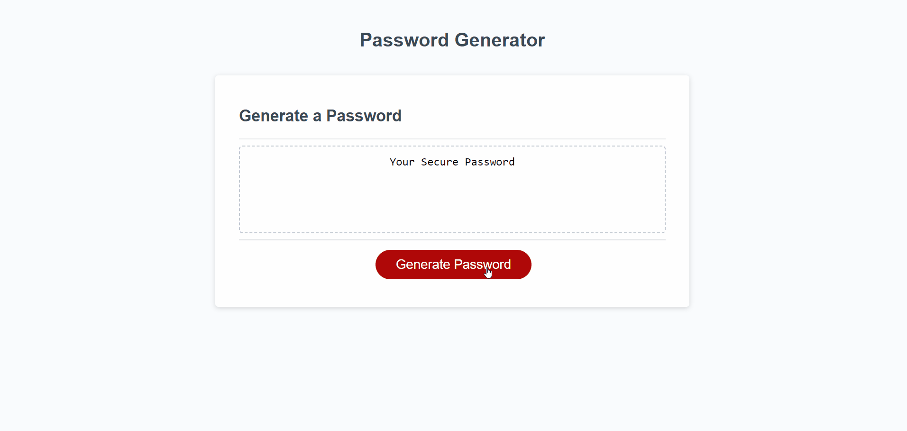

# PASSWORD GENERATOR

## Description
This project utilises conditional logic to build the user a personalised password using their own input and choices.

### Built With

## Getting Started

You can view the deployed project via [here](https://skechekar.github.io/password-generator) hosted on GitHub Pages.

### Usage

Click on "Generate Password" and enter your desired password length. Cycle through the options using "OK" as "YES" and "Cancel" as "NO". 

## Credits

[SkillIcons](https://skillicons.dev/) for the JavaScript and HTML5 icons used in the README

MDN Web Docs used for [if...else](https://developer.mozilla.org/en-US/docs/Web/JavaScript/Reference/Statements/if...else), [isFinite()](https://developer.mozilla.org/en-US/docs/Web/JavaScript/Reference/Global_Objects/isFinite), [Logical AND](https://developer.mozilla.org/en-US/docs/Web/JavaScript/Reference/Operators/Logical_AND), and [querySelector()](https://developer.mozilla.org/en-US/docs/Web/API/Document/querySelector).

## License

Licensed under the [MIT](/LICENSE) license.